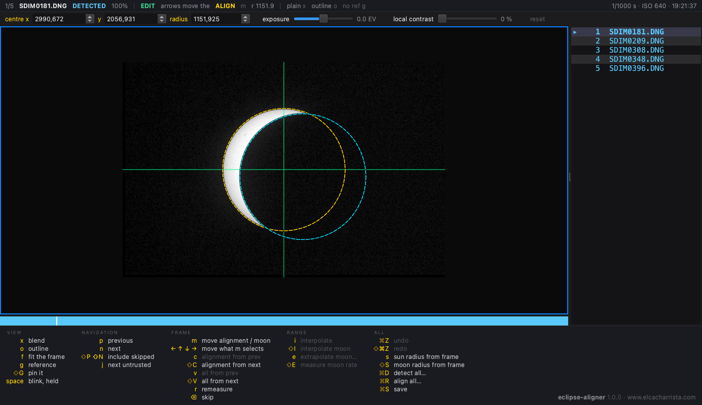

# eclipse-aligner

Aligns the frames of an eclipse timelapse so the sun stays put, by finding the
centre of the solar disc from whatever arc of its limb is still lit — and the
moon's from the arc it bites out. Each frame is centred on its own measurement,
with no smoothed trajectory to drift away from.

Reads EXR, DNG, Nikon NEF, Canon CR2/CR3 and JPEG, and writes each back in its
own format. Camera raw is shifted one Bayer sub-plane at a time, so a raw file
comes out as a legal DNG with its metadata intact.



## Getting it

There is a macOS app and a Windows installer on the
[releases page](https://github.com/jahurtado/eclipse-aligner/releases). Both
carry their own Python, so there is nothing to install beside them.

Neither is signed with a paid developer certificate, so the first launch is
blocked once and you allow it on purpose: on macOS through System Settings →
Privacy & Security, on Windows by clicking past the SmartScreen warning. Each
download carries a note saying so.

## From source

You need [uv](https://docs.astral.sh/uv/) and Python 3.10 or newer. There is
nothing to build and nothing to activate:

```sh
git clone https://github.com/jahurtado/eclipse-aligner.git
cd eclipse-aligner
./eclipse-aligner
```

The launcher hands the work to `uv run`, which builds the environment on the
first call. With no arguments it opens the window, which is how it is meant to
be used; a folder as the only argument opens that clip.

Building the desktop bundles yourself is described in
[packaging/README.md](packaging/README.md).

## How it works

Measuring is slow and fallible, moving pixels is fast and irreversible, and a
readable document sits between them: the expensive pass runs once, you fix the
handful of frames the detector missed, and only then is anything written. **The
originals are never written over.**

Finding the disc is the specialised half. Whatever bites into it — the moon in a
partial eclipse, the terminator on a crescent — is *concave*, so keeping only
the outline points on the convex hull discards it without having to model it,
and the moon is then fitted to the arc the hull threw away.

[](https://www.elcacharrista.com/en/articles/solar-eclipse-2026-timelapse/)

## Licence

GPL-3.0-or-later; the full text is in [LICENSE](LICENSE). Nothing GPL is
bundled here — the dependencies are LGPL (Qt, LibRaw) and BSD/MIT — so this is a
deliberate choice rather than an inherited obligation. What the desktop builds
carry inside them, and where its source is, is in
[THIRD-PARTY-LICENSES.md](THIRD-PARTY-LICENSES.md).

The idea of not modelling the trajectory came from studying
`solar-eclipse-timelapse-aligner`. Its algorithm was implemented here at one
point and dropped: the argmax flattens out below ~2 % illuminated area, which
is exactly a thin crescent. No derived code remains.

Its sibling is
[`hdrmerge-timelapser`](https://github.com/jahurtado/hdrmerge-timelapser), which
merges the bracketed sets this one aligns.
